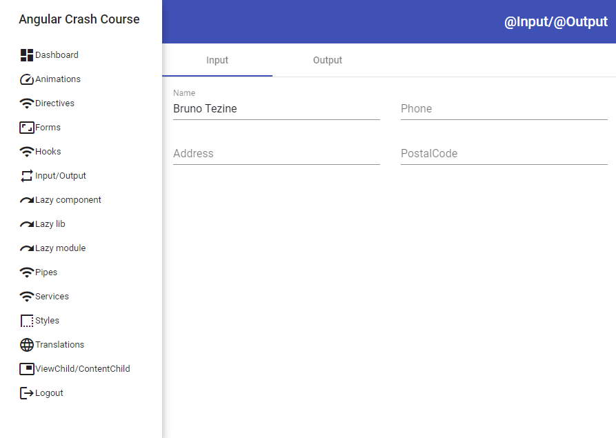

# Angular Crash Course
Complete tutorial + Sample Project covering most of Angular's features

<!--toc generated automatically by running markdown-toc -i Angular.md-->

<!-- toc -->

- [ANGULAR](#angular)
- [POC](#poc)
- [Project Structure](#project-structure)
- [Modules](#modules)
- [Components](#components)
  * [File structrure](#file-structrure)
  * [Lifecycle](#lifecycle)
  * [Input properties/parameters](#input-propertiesparameters)
  * [Output events](#output-events)
  * [ViewChild](#viewchild)
  * [ContentChild](#contentchild)
  * [Hooks](#hooks)
  * [Animations](#animations)
- [Forms](#forms)
  * [Template-driven forms](#template-driven-forms)
  * [Reactive forms](#reactive-forms)
- [Services](#services)
- [Pipes](#pipes)
- [Directives](#directives)
  * [Attribute Directives](#attribute-directives)
  * [Structural Directives](#structural-directives)
- [HttpClient](#httpclient)
- [Router](#router)
- [Angular Elements](#angular-elements)
- [Internationalization](#internationalization)
- [Server Side Rendering](#server-side-rendering)
- [PWA](#pwa)
- [Angular Workspace (App + one Lib)](#angular-workspace-app--one-lib)
- [Tests](#tests)
- [Deployment](#deployment)
- [Open API Integration](#open-api-integration)
- [CORS](#cors)

<!-- tocstop -->

* [Angular](https://angular.io/) is progressive, reactive typescript web framework that allows the creation of Single Page applications. The project is sponsored by Google and mostly used by enterprise level websites with complex and lots of pages and code files. It provides Behavior Driven Testing (BDD) out of the box, Router, Internationalization, Ahead of Time compiling, Server Side Rendering, Dependency injection, Animations, ...., and its own http client. 
* Angular provides its own [Command Line Interface (CLI)](https://cli.angular.io/) from where you can easily create applications, libraries and others. Angular also has support for centralized workspaces, where each [workspace](https://angular.io/guide/file-structure) may contain several Angular projects. "The top level of the workspace contains workspace-wide configuration files, configuration files for the root-level application, and subfolders for the root-level application source and test files."
* Applications can be easily updated to the newest version by following the procedure described [here](https://update.angular.io/) and there's an official material design components built in Angular. More info [here](https://material.angular.io/). 
* Angular has a built-in support for [Web Component](https://developer.mozilla.org/en-US/docs/Web/Web_Components) standard. By using a web component, it's possible to export Angular Components to be used outside Angular projects, so you may use them in a React, Vuejs, or any other Web framework. "Custom elements bootstrap themselves - they start automatically when they are added to the DOM, and are automatically destroyed when removed from the DOM". A more detailed information on how to create Web Components [here](https://angular.io/guide/elements).
* There are many enterprise level websites running Angular. You can check its showcase [here](https://www.madewithangular.com/)

# POC

* There's a Proof of Concept project following this material. You can find the code [here](./POC). The purpose of the POC is to exemplify all subjects mentioned in this document. It's composed by an Angular workspace with 1 application (core-project), 1 Angular library (users-lib), 1 Angular module (extra) ...
* It uses Material Design components, bootstrap css, internationalization, animations, services, lazy loading, template and reactive forms and many other features. 




# Workspace File Structure

* It is recommended to create a workspace whenever you want to start a new application from scratch. There's a detailed description on Angular website [here](https://angular.io/guide/file-structure) and a great tutorial provided by the community [here](https://www.tektutorialshub.com/angular/angular-folder-structure-best-practices/).
* Explaining the basics, we usually have a single application inside the workspace and several libraries and modules. Components, Pipes, Directives, Services can be added into any of these 3. All files can ben created by using `ng` command line interface. Usually, each Angular component creates 3 files (html, ts, and spec.ts). The `spec.ts` is a [Jasmine](https://jasmine.github.io/) BDD file for testing purposes. If your editor  supports file nesting, there's no need to add each component into a new folder. There are many flags available that you can set while adding a new file using `ng`, and you may choose the best match for your goals. 
* It's highly recommended that you split your application into several modules. This way, you won't have a frontend monolith loaded from a single chunk file. The accompanying POC exemplify on how to create the file structures when using modules and libraries. 
* Here are some important files in the workspace: 
  * angular.json: It's the workspace configuration file. Here you'll find all projects that belong to the workspace and specific configurations for each one. 
  * package.json : Different of a standard package.json, this file configures the npm dependencies used by all projects inside the workspace. 
  * tsconfig.json: Similar to the package.json, this file is workspace wide. Whatever you define for your typescript configuration, it applies to all projects.  

# Modules and Libraries

In Angular, sometimes we get confused on when to create a library and when to create a Angular Module. Here are the basic differences between them: 

* [Module](https://angular.io/guide/architecture-modules): A Module resides inside the project and it's only used within it. We can add components and others into the module and load the module at runtime when needed. A common scenario is to do Lazy Loading triggered by a specific route in your website. Ex: /users load the Users module, containing all users components, services... . Unfortunately, this approach requires you to download the module source code in order to accomplish the lazy load, and that's why it's called as "mono repository/monorepo" approach. 
* [Library](https://angular.io/guide/libraries): A library is more appropriate when you wish to share it with several projects. This way, the application that uses the library doesn't have to access the library code, only the compiled bundle. It's even possible to do lazy loading of a library without having its source code, but it requires you to define a module wrapper into the consumer application. When working with complex projects, splitting codes into libraries is a good approach. This way, you are free from monorepo, so you don't need to download the entire workspace in order to modify something inside a specific library. 

## Libraries

[Angular libraries](https://angular.io/guide/creating-libraries) can only be used within Angular projects. If you intend to create a library to be used outside Angular, create a [Angular Element](https://angular.io/guide/elements). We can create a Angular library by executing the following command: 

```bash
ng new my-workspace --create-application=false # creates the an empty Angular workspace
cd my-workspace
ng generate library my-lib # creates the library project. 
```

Remember to define which components are exported by your library in your `my-lib.module.ts` and also in your `public_api.ts`. Components not explicitly exported cannot be imported and used in an Angular app. 

After finalizing the library code, you can build it like this:

```bash
ng build my-lib --prod
cd dist/my-lib
npm publish # This publishes into NPM repository. Please notice that Angular do not recommend to publish Ivy libraries to npm. 
```

If the library resides in a workspace, you can build it from the top level folder: `ng build --project my-lib`. The chunk file will be generated into the folder defined in your `ng-package.json` of your library. Notice that Angular Libraries have their own `package.json` and a file named `tsconfig.lib.json`, which does the same as `tsconfig.json`. You can than use `npm link` to debug your lib together with the main app. 

You can consume your library, by executing the following command in your app:

```bash
npm install my-lib --save
# now you can import its components, services... in your app module. 
```

### Lazy Loading Libraries

It's possible to do lazy loading of Angular libraries. To do so, follow the steps below:

1. Add your library as a dependency the `package.json` of your workspace or app. Ex:

```json
"dependencies": {
    "users-lib": "file:projects/users-lib",
},
```

2. Add the path into `tsconfig.json` of your workspace to make it easier to find your library path. Ex:

```json
"lib": [
    "es2018",
    "dom"
],
"paths": {
    "@myLib": [
        "dist/users-lib"
    ],
    "@myLib/*": [
        "dist/users-lib/*"
    ]
}
```

3. In case you wish to lazy load the library chunk according to a specific Angular Route, you can just add the following line into your `app-routing.module.ts`: 

```typescript
{path: 'users', loadChildren: () => import('@myLib').then(m => m.UsersModule)},
```

For more information, there's a community tutorial about lazy loading libraries [here](https://medium.com/@tomastrajan/why-and-how-to-lazy-load-angular-libraries-a3bf1489fe24) and a working sample inside the POC. 

## Modules

Angular Modules is the easiest way to do code splitting in your Angular application. Angular modules are not standard javascript modules. They provide some extra informations and they usually belong to a single Angular project. Normally, not used outside as a library. 

Angular Modules group components, services, directives, pipes and so on. Even when you create an application, Angular creates a "main" module for you, where by default all components/sevices... will be part of. As your app grows, it's a recommended that you split the app into several modules. This way, you can lazy load the chunk files by demand during runtime. It's really easy to accomplish this task in Angular. 

### Lazy Loading Modules

Follow the steps below to do lazy loading of modules in your Angular application. There's also a sample code inside the POC exemplifying this particular scenario. 

1. Create a module inside your Angular application

```bash
ng generate module CustomerDashboard
```

2. Restructure your project folder in a way that you have all components/services... inside the module folder. (There's an example in the POC).
3. Add some routing into the module, if you wish.
4. Now, just add the following line into your `app-routing.module.ts` : 

```typescript
{path: 'lazy-module', loadChildren:  async () => (await import('../src/extra-module/extra.module')).ExtraModule},
```

This will do the lazy loading of your module whenever the path 'lazy-module' is passed to the Angular Router. Different from loading a library, you MUST supply the source code of the module, or Angular display an error while compiling your app. That's why this is considered a "monorepo" approach. 

# Components

In Angular, every page or every widget is a considered a component. There's no difference between them. 

## File structrure

Different from [Vuejs](https://vuejs.org/) or [Svelte](https://svelte.dev/), Angular Components are usually splitted into 3 files: 

1. Html template file (.html)
2. Typescript file (.ts), where the component's logic resides. 
3. Stylesheet file (scss, css, stylus, less...). Stylesheets are scoped/isolated by default in Angular, so whatever you define in your component stylesheet is not spread over other components. 
4. Spec file. Spec files are [Jasmine](https://jasmine.github.io/) test files that are executed by [Karma](https://karma-runner.github.io/latest/index.html). 

It's also possible to have html/typescript/css into the same file, but it's not a common usage and discouraged by the community. 

## Lifecycle

* ngOnChanges(): fired whenever Angular sets or resets data-bound input properties
* ngOnInit(): fired once, after Angular display data-bound properties.
* ngDoCheck(): fired upon changes that cannot be detected by Angular on its own. 
* ngAfterContentInit(): fired once after what is passed to ng-content is rendered. 
* ngAfterContentChecked(): fired after what is passed to ng-content pass through the ngDoCheck 
* ngAfterViewInit(): fired once after the view and it's child views are rendered. 
* ngAfterViewChecked(): fired whenever Angular checks for the rendered view or its children. 
* ngOnDestroy(): fired just before Angular destroy the component. 

More about lifecycle hooks [here](https://angular.io/guide/lifecycle-hooks).

## Input properties/parameters

Angular provides the [@Input()](https://angular.io/api/core/Input) decorator to allow the component to receive input properties. Ex: 

```html
<!--App.component.html-->
<MyComponent title="Batman"></MyComponent>
```

```typescript
//MyComponent.component.ts
export class MyComponent {
  @Input() title:string='';
}
```

```html
<!--MyComponent.component.html-->
<div>
  Hello {{title}}    
</div>
<!--Displays Hello Batman --> 
```

## Output events

Similar to @Input, Angular provides the [@Output](https://angular.io/guide/inputs-outputs) decorator to fire events from the component. These events can be captured on the caller component. Ex:

```html
<!--App.component.html-->
<VInput (textChanged)="onTxtNameChanged($event)"></VInput>
```

```typescript
//App.component.ts
export class InputOutputComponent {
  onTxtNameChanged(txt:string){
    console.log('text entered in VInput:',txt)
  }
}
```

```typescript
//VInput.component.ts
export class VInputComponent {
  @Output() textChanged: EventEmitter<string> = new EventEmitter();

  onModelChanged(txt:string){
    this.textChanged.emit(txt);
  }
}
```


```html
<!--VInput.component.html-->
<input (ngModelChange)="onModelChanged($event)">
```

## DOM events

It's also possible to capture every DOM event inside a Angular Component. Ex:

```typescript 
export class VInputComponent {
  @HostListener('mouseenter') onMouseEnter() {
    console.log('mouse enter');
  }
}
//whenever the mouse enters into the component, the function "onMouseEnter" is fired.
```


## ViewChild

Whatever DOM element you insert into your Angular Component, is considered a [ViewChild](https://angular.io/api/core/ViewChild) and it's accessible from typescript after rendered. Ex:

```html
<!--App.component.html-->
<div #viewChildDiv>hello</div>
```

```typescript
export class AppComponent{
	@ViewChild('viewChildDiv') viewChildDiv?: ElementRef;
	
	ngAfterViewInit(): void {
    	if(this.viewChildDiv)this.viewChildDiv.nativeElement.style["backgroundColor"] = "orange";
    }
}
//Div color is changed to orange after rendered inside AppComponent
```

## ContentChild

Whatever you pass inside the DOM element is considered a ContentChild. The content passed can be rendered inside a `<ng-content>` tag. Ex:

```html
<!--app.component.html-->
<VHello>World!</VHello>
```

```html
<!--vhello.component.html-->
<p>Hello <ng-content></ng-content></p>

<!-- prints Hello World! -->
```

It's possible to have multiple `<ng-content>` and project content according to the type of content provided. This approach is also called "Multi-Slot Content Projection". You may find out more on how to achieve it [here](https://blog.angular-university.io/angular-ng-content/).

## Animations

Although it seems too complicated to create animations in html, Angular makes things easier. The framework provides it's own animation framework and it's quite powerful and well documented. You find the complete documentation [here](https://angular.io/guide/animations). 

The accompanying POC demonstrates a simple animation where we have a page requesting the user's email and password and a button. The components are displayed inside a div container with material elevation. Everything starts with `state='open'` . When user clicks the button, the state is changed to `closed` and the animation is triggered automatically. Follow the code below: 

```html
<!--animations.component.html-->
<div class="container p-3" [class.mat-elevation-z8]="true" [@openClose]="isOpen ? 'open' : 'closed'" >
    <div class="row">
        <VInput label="Email" class="col-md-12"></VInput>
    </div>
    <div class="row">
        <VInput label="Password" class="col-md-12"></VInput>
    </div>
    <button mat-raised-button color="primary" (click)="onBtnToggleClicked()" class="float-right">Animate</button>
</div>
```

```typescript
//animations.component.ts
@Component({
  selector: 'app-animations',
  templateUrl: './animations.component.html',
  styleUrls: ['./animations.component.scss'],
  animations: [
    trigger('openClose', [
      state('open', style({
        height: '200px',
        width: '400px',
        opacity: 1,
        backgroundColor: 'yellow'
      })),
      state('closed', style({
        height: '250px',
        width: '450px',
        opacity: 0.9,
        backgroundColor: '#00e676'
      })),
      transition('open => closed', [
        animate('1s')
      ]),
      transition('closed => open', [
        animate('0.5s')
      ]),
    ]),],
})
export class AnimationsComponent {
  isOpen = true;

  onBtnToggleClicked(){
    this.isOpen = !this.isOpen;
  }
}
```

What happens above is that when user clicks the `Animate` button, `onBtnToggleClicked` is called and the state changes to `closed`. The DOM element that will be animated is defined by the `[@openClose]` tag in the html and the corresponding trigger named `openClose` in the typescript. The animation above changes the `div` background color and increases the height/width a little. As you can see, it's not so complex! :-) 

# Forms

* Angular allow the creation of [web forms](https://angular.io/guide/forms-overview) in 2 different ways. It's up to you to decide which one you like best! 

## Template-driven forms

* [Template-drive forms](https://angular.io/guide/forms) binds its data directly to variables and you you can think as "do yourself" approach, since you have to validate, display errors, and others manually. Despite of that, template-drive is straight forward. It's easy to understand and code. You can find a sample code in the POC, which is similar to the code below: 

```html
 <form  (ngSubmit)="onTemplateDrivenFormSubmit()" >
     <div class="row">
         <mat-form-field class="col-md-6">
             <mat-label>First name</mat-label>
             <input matInput [(ngModel)]="firstName" id="txtFirstName" name="txtFirstName" required minlength="4">
         </mat-form-field>
         <mat-form-field class="col-md-6">
             <mat-label>E-mail</mat-label>
             <input matInput [(ngModel)]="email" id="txtEmail" name="txtEmail" required email>
             <mat-hint>Errors appear instantly!</mat-hint>
         </mat-form-field>
     </div>
     <div class="row p-3">
         <button mat-raised-button color="primary" class="float-right" type="submit">Submit form</button>
     </div>
</form>
```

```typescript
export class FormsComponent {
  firstName='';
  email='';

  onTemplateDrivenFormSubmit(){
    console.log('Template driven form values:', this.firstName, this.email);
  }
}
```

Basically, in the code above we have a form with 2 text-fields and a button. Whenever something changes in text-fields, Angular automatically updates the corresponding variable (`firstName or email`). This is done through [ngModel](https://angular.io/api/forms/NgModel), which binds the controls to the variable. The form itself fires the `onTemplateDrivenFormSubmit` when the button (marked as type=submit) is clicked. Plain simple! 

## Reactive forms


```html
<!--app.component.html-->
<form [formGroup]="profileForm" (ngSubmit)="onReactiveFormSubmit()">
     <div class="row">
         <mat-form-field class="col-md-6">
             <mat-label>First name</mat-label>
             <input matInput formControlName="firstNameControl">
             <mat-error *ngIf="profileForm.touched && firstNameControl.invalid">First name invalid</mat-error>
         </mat-form-field>
         <mat-form-field class="col-md-6">
             <mat-label>E-mail</mat-label>
             <input matInput formControlName="emailControl">
             <mat-hint>Errors appear instantly!</mat-hint>
         </mat-form-field>
     </div>
     <div class="row p-3">
         <button mat-raised-button color="primary" class="float-right" type="submit">Submit form</button>
     </div>
     <div class="row">
         <div class="alert alert-danger col-md-12" *ngIf="emailControl.invalid">E-mail invalid</div>
     </div>
</form>
```

```typescript
//app.component.ts
export class AppComponent {
  firstNameControl= new FormControl('',[Validators.required,Validators.minLength(4)]);
  emailControl= new FormControl('',[Validators.required,Validators.minLength(4), Validators.email]);
  profileForm = new FormGroup({
    firstNameControl: this.firstNameControl,
    emailControl:this.emailControl
  });

  onReactiveFormSubmit(){
    console.log('Reactive form values:', this.profileForm.value);
    this.profileForm.markAllAsTouched();
  }
}
```

As you may notice in the code above, Reactive Forms do not change the variables directly. Instead, the content comes from a [FormGroup](https://angular.io/api/forms/FormGroup) and [FormControl](https://angular.io/api/forms/FormControl). Using these controls, we can define initial values, add multiple validators, and check if the control has valid/invalid content from html. This approach is quite useful when you have lots of inputs and complex validations.

# Services

[Services](https://angular.io/guide/architecture-services) are used as `Singletons` that are injected into a Angular Component or other Service when needed. Prior to Angular 6, services had to be declared as a provider explicitly in the module, but now we only need to specify in which Angular module the Service will be injected. Follow sample usage to retrieve a list of employees from a Restful Server:

```typescript 
//employees.service.ts
@Injectable({
  providedIn: 'root' //this indicates that this service is injected into the Angular root module of your project
})
export class EmployeesService {

  constructor(private httpClient:HttpClient) { }//httpClient is also a service injected here. :-) 

  public async getEmployees(): Promise<Employee[]>{
    let result=await this.httpClient.get<Employee[]>('http://dummy.restapiexample.com/api/v1/employees').toPromise();
    return result.data;
  }
}
```

```typescript
//app.component.ts
export class AppComponent implements OnInit {
  employees?:Employee[];
    
  constructor(private employeesService:EmployeesService) {//service singleton injected here      
  }

  async ngOnInit() {
    this.employees= await this.employeesService.getEmployees();
   }
}
```

The `EmployeesService` above can be used by any component/service. All you need is to "inject" it into the constructor of your component like `private employeesService:EmployeesService`. After doing this, you can access any function/property defined in the service. 

# Pipes

[Pipes](https://angular.io/guide/pipes) allow to transform data before rendering into the DOM. It's commonly used to transform date formats, amounts, and any other number or string that requires to be formatted and/or modified prior to display into the browser. The POC contains a small sample demonstrating how pipes are created and used. In the example below, we have a pipe called `fileSize` that displays the file size in megabytes: 

```typescript
//file-size.pipe.ts
@Pipe({name: 'fileSize'})
export class FileSizePipe implements PipeTransform {

  transform(size: number, extension: string = 'MB'): string {
    return (size / (1024 * 1024)).toFixed(2) + extension;
  }
}
```

```html
<!--app.component.html -->
<div>
    <p>File: {{ file.name }}</p>
    <p>File size: {{ file.size | fileSize }}</p>
</div>
```

```typescript
//app.component.ts
export class AppComponent {
  file = { name: 'logo.svg', size: 2120109, type: 'image/svg' };
}
```

# Directives

Angular Directives are used to extend the power of HTML by giving it new syntax. 

## Attribute Directives

"[Attribute Directives](https://angular.io/guide/attribute-directives) changes the appearance or behavior of a DOM element.". For instance, we can create a directive to highlight a text, to change it's color, to resize the content, reposition, and so on. Whatever modification needed to display the element in the browser. 

The POC contains a sample, which is similar to the code below. It demonstrates a directive used to underline the text of a DOM element:

```typescript
//underline.directive.ts
@Directive({selector: '[appUnderline]'})
export class UnderlineDirective {

  constructor(el: ElementRef) {
    el.nativeElement.style.textDecoration = 'underline';
  }
}
```

Here's how you can use the directive created above: 

```html
<!--app.component.html -->
<p appUnderline>Underline me!</p>
```

## Structural Directives

"[Angular Structural Directives](https://angular.io/guide/structural-directives) are responsible for HTML layout. They shape or reshape the DOM's *structure*, typically by adding, removing, or manipulating elements.". Every structural directive begins with an `*`. Angular itself provides several structural directives. Ex: `*ngIf, *ngFor, *ngSwitchcase`...  Different from attribute directive, which acts over one single element, the structural directives adds/removes and change other elements in the DOM. They tend to be more complex to create but are more powerful. 

Follow below a sample that does the opposite of `*ngIf`. If the content is displayed unless the condition is set to true:

```typescript
//display-undless.directive.ts
@Directive({selector: '[displayUnless]'})
export class DisplayUnlessDirective {
    private hasView = false;

    constructor(private templateRef: TemplateRef<any>,private viewContainer: ViewContainerRef) {
    }

    @Input() set displayUnless(condition: boolean) {
        if (!condition && !this.hasView) {//display only if condition==false
            this.viewContainer.createEmbeddedView(this.templateRef);
            this.hasView = true;
        } else if (condition && this.hasView) {
            this.viewContainer.clear();
            this.hasView = false;
        }
    }
}
```

 ```html
<!--app.component.html-->
<p *displayUnless="condition">This paragraph is displayed if condition==false</p>
<button mat-raised-button color="primary" (click)="onBtnToggleClicked()" >Toggle condition</button>
 ```

```typescript
//app.component.ts
export class DirectivesComponent {
  condition=false;

  onBtnToggleClicked(){
    this.condition=!this.condition;
  }
}
```

# Router

Angular provides a powerful [router](https://angular.io/guide/router) to navigate between pages. These pages are rendered inside a `<router-outlet>` element. It's possible to have multiple `<router-outlet>` elements in order to create sub-routes, and we can have [guards](https://angular.io/guide/router-tutorial-toh#milestone-5-route-guards) to prevent users from navigating to parts of an app without authorization. There's a complete sample code in the POC where you can see it working. 

Follow a sample below on how to create routes in your Angular application:

```html
<!--app.component.html -->
<p>This text never changes</p>
<router-outlet></router-outlet>
<p>This also never changes</p>
```

Since `app.component.html` above is our main top level html file, views are displayed inside the `<router-outlet>` according to the route provided, but everything that is written outside the `<router-outlet>` is fixed and always displayed. This is quite useful since we can create layouts that changes only parts of the content, while keeping other elements. 

```typescript
//app-routing.module.ts
const routes: Routes = [
    {path: '', redirectTo: 'login', pathMatch: 'full'},
    {path: 'login', component: LoginComponent},
    {path: 'home', component: HomeComponent, children:[
        //this is a child route, because we have a <router-outlet> inside HomeComponent
        {path: 'lazy-module', loadChildren:  async () => (await import('../src/extra-module/extra.module')).ExtraModule},
    ]
    },
];
```

The routes above indicate that when there's no route provided (ex: mydomain.com/<nothingelse> ), the `LoginComponent` will be displayed in the `<router-outlet>` element. Then, users can navigate to `/home`, when `HomeComponent` is rendered, and at last,  we have another `<router-outlet>` inside `HomeComponent`  that is used to display a child/nested route `/home/lazy-module`. The cool thing is that this route do a lazy loading of the chunk file generated by the `ExtraModule`, and more child routes can continue from there. Ex: 

Under `ExtraModule`, we have the following routes:

```typescript
//extra-routing.module.ts
const routes: Routes = [
    {path: '', component: ExtraComponent, children: [//route: /home/lazy-module 
      {path: 'users', component: UsersComponent,},
      {path: 'users/edit', component: UsersEditComponent},
]}];
```

The code above provides all the routes starting with `/home/lazy-module`, so whatever comes later (ex: /home/lazy-module) will be handled by the routing table provided in `extra-routing.module.ts`. 

We can navigate to routes by html or by typescript. Ex:

```html
<!--some.component.html -->
<nav>
  <a routerLink="/home" routerLinkActive="active">Home</a>
</nav>
```

If user clicks on `Home` link above, the route will change to `/home` which renders the `HomeComponent`, as defined in the app-`routing.module.ts`. We could also navigate from code. Ex:

```typescript
export class LoginComponent{
    
    constructor(protected router: Router) { } //Router is a service injected
    
  	async onBtnLoginClicked(){
	    await this.router.navigate(['home']);
	}
}
```

# Internationalization

There are several tools that provide internationalization to Angular. Angular itself has the [i18n](https://angular.io/guide/i18n), but there are others like [NGXTranslate](http://www.ngx-translate.com/), and some others provided by the community. Take a look at the POC provided to see how it works. Basically, we can run a tool to generate a json file where we can enter all the translations and these translations are loaded automatically depending on the user's browser language or manually by code (ex: when user explicitly changes the language from a comboBox). 

# Tests

Angular has a great support for [BDD](https://pt.wikipedia.org/wiki/Behavior_Driven_Development) and [Unit Testing](https://en.wikipedia.org/wiki/Unit_testing). It comes with [Jasmine](https://jasmine.github.io/) and [Karma](https://karma-runner.github.io/latest/index.html) integrated in a way that, whenever you add a new component into your project, Angular automatically creates the Jasmine spec for you. 

Follow a sample where we do some testing with the Login page below: 

```typescript
//Login.component.ts
export class LoginComponent {
  email?:string;
  password?:string;
  errorMsg?:string;
  @ViewChild('errorDiv') errorDiv?: HTMLDivElement; 

  constructor(protected router: Router, private usersService:UsersService) { }

  async onBtnLoginClicked():Promise<void>{
    if(!await this.authenticateUser()) return;
    else await this.router.navigate([Defines.routeUsers]);
  }

  async authenticateUser():Promise<boolean>{
    this.errorMsg=undefined;
    let ok=await this.usersService.authenticate(this.email,this.password);
    if(ok)return true;;
    this.errorMsg = 'Invalid credentials';
    return false;
  }
}
```

```typescript
//login.component.spec.ts
describe('LoginComponent', () => {
  let component: LoginComponent;
  let fixture: ComponentFixture<LoginComponent>;

  beforeEach(async(() => {
    TestBed.configureTestingModule({
      declarations: [ LoginComponent ],
      imports: [RouterTestingModule, HttpClientModule],
      providers:[UsersService]
    })
    .compileComponents();
  }));

  beforeEach(() => {
    fixture = TestBed.createComponent(LoginComponent);
    fixture.debugElement.nativeElement.style.visibility = "hidden";//use this to hide the component from karma result
    component = fixture.componentInstance;
    fixture.detectChanges();
  });

  it('Test with invalid credentials', async () => {
    component.email=undefined;
    component.password=undefined;
    let result=await component.authenticateUser();
    expect(result).toBeFalse();
    //let's wait for dom updates and check if the error div is displayed.
    fixture.detectChanges();
    let errorDiv = fixture.debugElement.query(By.css('#errorDiv')); //div must be like <div id="errorDiv"></div>
    expect(errorDiv).toBeTruthy()
  });

  it('Test with valid credentials', async () => {
    component.email='bruno@tezine.com';
    component.password='tata';
    let result=await component.authenticateUser();
    expect(result).toBeTrue()
  });
});
```


# Open API Integration

It's pretty easy to generate client REST calls as Angular Services to your Angular project if you have a swagger generated somewhere else. There's a great tool called [Open API Generator](https://openapi-generator.tech/) that generates it automatically for you, so NO MORE writing REST calls by hand! :-)   

All you have to do is follow these 2 steps below:

1. install `Open API Generator` in your machine: `npm install @openapitools/openapi-generator-cli -g`
2. execute open-api-generator in your workspace: 

```bash
openapi-generator generate -i http://localhost:5000/swagger/v1/swagger.json -g typescript-angular -o ./projects/myapp-api --additional-properties="ngVersion=10.0.0" --import-mappings=Date=java.sql.Date --type-mappings=Date=string
```

The example above generates all the REST APIs into a new Angular project called `myapp-api` and does some mapping to translate java Dates to typescript string. After executing the steps above, you have to import the `myapp-api` into your project and you're ready to make rest calls. Ex:

Add the following lines into your `app.module.ts`:

```typescript
export function apiConfigFactory(): Configuration {
  const params: ConfigurationParameters = {
    // set configuration parameters here like Oauth, JWT, user/password...
  }
  return new Configuration(params);
}

@NgModule({
  declarations: [
    ...
  ],
  imports: [
    ApiModule.forRoot(apiConfigFactory),
    ...
  ],
```

Now, you can make REST calls: 

```typescript
//login.component.ts
export class LoginComponent{
    
    constructor(private usersService: UsersService){//UsersService was created by open-api-generator        
    }
    
    onBtnLoginClicked(){
        let userID = await this.usersService.authenticate('email','mypassword').toPromise();
    }
}
```

# CORS

In order to enable CORS in your Angular application to allow http requests to other domains/ports, add a file named `proxy.conf.json` as below in your root folder:

```json 
{
    "/api/*": {
        "target": "http://mydomain.com:9090",
        "secure": false,
        "logLevel": "debug"
    }
}
```

Now, just add the line `proxyConfig` in your `angular.json` inside `serve` as showed below:

```json
"serve": {
          "builder": "@angular-devkit/build-angular:dev-server",
          "options": {
            "browserTarget": "meuprojeto:build",
            "proxyConfig": "src/proxy.conf.json"
          },
```

That's it! Now your Angular application is ready to forward API requests to a microservice hosted at http://mydomain.com:9090

# Typescript properties

Every Angular workspace has a `tsconfig.json` file. All typescript configurations used by the projects in the workspace are written in it. There are a few [compiler options](https://www.typescriptlang.org/docs/handbook/compiler-options.html) that are very important and are described below:

1. `strict`: Strict is an important option that is disabled by default, but it's highly recommended to enable it. Basically, when disabled, you can write typescript as pure javascript (non typed). If you enable it, the compiler will display an error whenever you try to create a property that should never be null (without `?` at the end. Ex: `title:string` ). It'll display an error when you don't specify function parameter types, and many other options. There's a good explanation about `strict` [here](https://medium.com/webhint/going-strict-with-typescript-be3f3f7e3295).
2. `removeComments`: I have no idea why, but this flag is disabled by default, so it's important to enable it in order to remove your code comments for the production build. 

# Advanced Scenarios

## Component Lazy Loading

One of the cool features that Ivy brought to Angular in version 9, was the ability to do Lazy Loading for Angular Components. There are several tutorials explaining on how to make it work in several ways. Check it out [here](https://indepth.dev/lazy-loading-angular-modules-with-ivy/) and [here](https://netbasal.com/welcome-to-the-ivy-league-lazy-loading-components-in-angular-v9-e76f0ee2854a). In the future, I'll add more info here. :-P 

Enjoy! 

